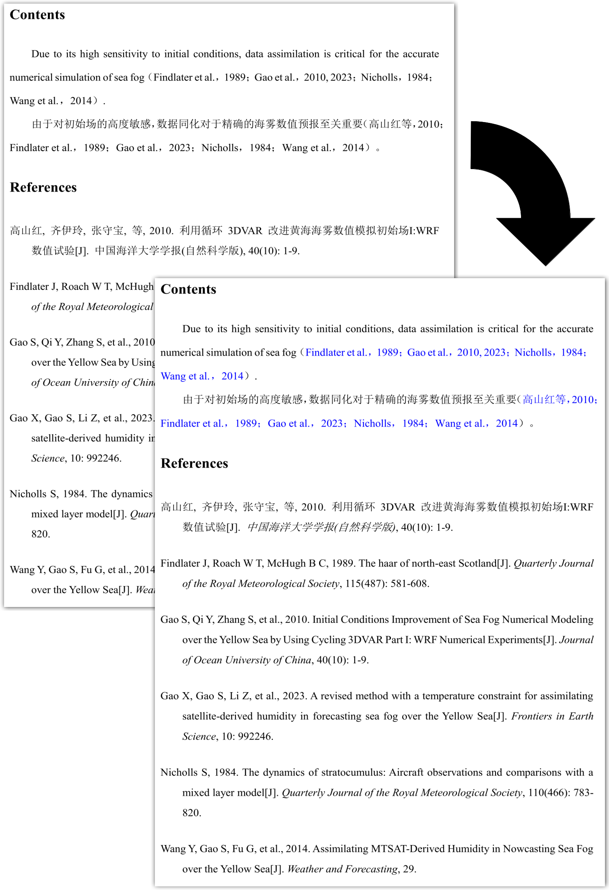
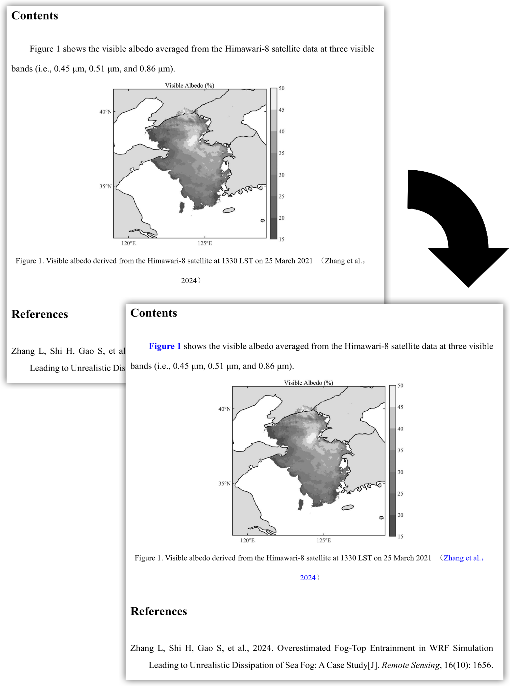

# Noterools: Not just Zotero Tools

<p align="center"><a href="README.md">中文文档</a> | English</p>

At the beginning, I just wanted to write a Python implementation based on [gwyn-hopkins](https://forums.zotero.org/discussion/comment/418013/#Comment_418013)'s code to add clickable hyperlinks to Zotero citations. However, as my paper underwent more revisions, I found myself needing to make increasingly complex formatting adjustments. Consequently, the functionality of the code expanded. After extensive refactoring, noterools was born.

## What is this?

Currently, noterools can help you do the following things:

- Create bookmarks for each reference in the Zotero bibliography.
- Set hyperlinks for Zotero citations that navigate to the corresponding references and adjust whether the hyperlinks are underlined.
- Customize the font color of Zotero citations.
- Italicize journal names and publishers in the Zotero bibliography that aren't correctly formatted as italics.
- Adjust the font color and weight for cross-references within the main text.
- Replace the hyphen (-, Unicode 002D) used for page ranges in the bibliography with an en dash (–, Unicode 2013).
- (Experimental Feature) Modify the capitalization style of English reference titles. Supports three styles: ALL CAPS, Title Case (Capitalize Each Word), and Sentence case (Capitalize first word only).

## Screenshots





## Important Note

- **This script can only work in Windows.**

## How to use?

1. Install noterools via pip.

```bash
pip install noterools
```

2. Create a Python script and run it. Here is a simple example.

```python
from noterools import Word, add_cross_ref_style_hook
from noterools._entry import add_citation_cross_ref_hook

if __name__ == '__main__':
    word_file_path = r"E:\Documents\Word\test.docx"
    new_file_path = r"E:\Documents\Word\test_new.docx"

    with Word(word_file_path, save_path=new_file_path) as word:
        # Add hyperlinks for numbered citation formats.
        add_citation_cross_ref_hook(word, is_numbered=True)

        # Add hyperlinks to (Author, Year) citation format, set the citation font color to blue.
        # By default, container titles or publishers in the bibliography that are not correctly italicized will be set to italics.
        # add_citation_cross_ref_hook(word, is_numbered=False)

        # By setting the value of color, you can change the color of the entire citation (excluding the parentheses).
        # 0: Black
        # 16711680: Blues
        # For more colors, please see: https://learn.microsoft.com/en-us/office/vba/api/word.wdcolor
        # add_citation_cross_ref_hook(word, is_numbered=False, color=0)

        # set_container_title_italic is used to control whether to correct names in the bibliography that are not properly italicized.
        # You can disable this feature by setting it to False.
        # add_citation_cross_ref_hook(word, is_numbered=False, set_container_title_italic=False)

        # Set the font color and bold style for cross-references starting with 'Figure' in the main contents.
        add_cross_ref_style_hook(word, color=16711680, bold=True, key_word=["Figure"])

        # Replace the hyphen with en dash, you need to provide your Zotero ID and Zotero API key.
        # Please refer to the pyzotero documentation to find your Zotero ID and apply for an API key.
        # https://pyzotero.readthedocs.io/en/latest/#getting-started-short-version
        # add_update_dash_symbol_hook(word, "Your ID", "Your key")

        # Change English articles' title format to All CAPS.
        # add_format_title_hook(word, upper_all_words=True)

        # Change English articles' title format to Title Case (minor words will be changed too).
        # add_format_title_hook(word, upper_first_char=True)

        # Change English articles' title format to Sentence Case.
        # add_format_title_hook(word, lower_all_words=True)

    # You can give a list contains proper noun when change format to Sentence Case.
    # word_list = ["UNet", "US", "China", "WRF"]
    # add_format_title_hook(word, lower_all_words=True, word_list=word_list)
```
